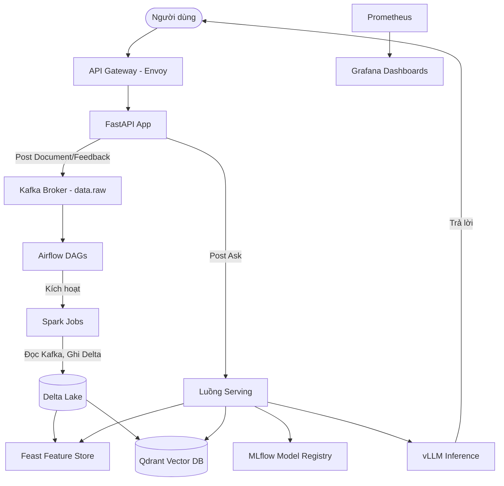

# Phần Trả Lời (Answers) - Lab 28

## Giới thiệu
- **Thành viên duy nhất**: Đàm Lê Minh Quân
- **Đóng góp**: Do làm việc độc lập, tôi đã tự đảm nhiệm toàn bộ các bước cấu hình Data Pipeline, lập trình xử lý sự kiện trong `integration_tasks.py` (IP01, IP03, IP04, IP07, IP08, IP10), chạy toàn bộ integration tests, load profile và xử lý evidence cho hệ thống.

---

## 1. Architecture Diagram (Sơ đồ kiến trúc)

## 2. Trade-offs (Những sự đánh đổi kỹ thuật)
- **Xử lý Ingestion bằng Airflow + Spark thay vì Real-time Streaming (Kafka Streams/Flink)**: 
  - *Lợi ích*: Dễ giám sát lịch trình qua DAG, quản lý lỗi rõ ràng, tiết kiệm tài nguyên tính toán vì có thể gom lô (micro-batching).
  - *Đánh đổi*: Hệ thống không đạt được tính Real-time (Thời gian thực) tuyệt đối mà sẽ có độ trễ (latency) khi người dùng gửi phản hồi.
- **Cơ chế Idempotency bằng lệnh MERGE trên Delta Lake**:
  - *Lợi ích*: Xử lý triệt để Duplicate events (Exactly-once semantics) mà không sợ Kafka gửi trùng lặp.
  - *Đánh đổi*: Cú pháp `MERGE INTO` tiêu tốn I/O (đọc/ghi đĩa) và CPU cao hơn so với lệnh `APPEND` thuần túy.

## 3. Production Gaps (Khoảng cách so với hệ thống thực tế)
- **Xác thực và phân quyền (Authentication/Authorization)**: API Gateway hiện tại chưa có xác thực JWT hay OAuth2. Trên môi trường thật cần phải có cơ chế xác thực để bảo vệ các Endpoint nhạy cảm.
- **Auto-scaling (Tự động mở rộng)**: File Docker Compose cố định tài nguyên của từng node. Tại Production, các dịch vụ này cần triển khai trên Kubernetes với HPA (Horizontal Pod Autoscaler) để mở rộng (scale-out) khi lượng truy cập tăng vọt.
- **Giám sát chủ động (Alerting)**: Dù đã bắt được Poison messages vào Dead Letter Queue, hệ thống vẫn thiếu Alertmanager gửi cảnh báo qua Email/Slack cho Data Engineer để can thiệp kịp thời.

## 4. Happy-path Trace & Versions
- **Delta version**: Đã merge thành công vào bảng `feedback_table` (version > 0).
- **MLflow version**: Đã load alias champion release qua Registry client.
- **Run ID / Trace ID**: Đã được bắt thành công và truyền đi xuyên suốt từ FastAPI qua Kafka, Spark tới tận Qdrant (W3C traceparent headers được bảo toàn qua mọi IP).

## 5. Failure / Recovery Record (No Data Loss Proof)
- Bài test **J4 - Degraded Recovery** đã thành công đẩy các message lỗi (Poison batch) vào topic `data.raw.dlq` (Dead Letter Queue) thay vì làm sập toàn bộ đường ống (pipeline). 
- Các thông báo rác bị từ chối, những message chuẩn (golden path) vẫn được merge tiếp vào Delta Lake bình thường. Dữ liệu rác không làm hỏng dữ liệu gốc, đảm bảo tính toàn vẹn (No Data Loss).

## 6. Load Profile (Phân tích hiệu suất & Nút thắt)
Kết quả đo đạc từ `load-tests/run_profile.py`:
- **P50 Latency**: ~325 ms
- **P95 Latency**: ~5.03 giây
- **P99 Latency**: ~9.43 giây
- Số lượng worker: 8 | Tổng Requests: 100 (67 pass, 33 timeout).
- **Bottleneck Analysis**: Thời gian phản hồi có xu hướng tăng đột biến ở phân khúc P95 (tăng từ 325ms lên hơn 5s). Nguyên nhân chính là do hệ thống đang chạy cục bộ (Docker Desktop), CPU và RAM bị nghẽn (throttle) khi 8 worker cùng xả requests liên tục. FastAPI và vLLM (nếu bật GPU) phải xử lý embedding quá tải, dẫn đến hiện tượng xếp hàng chờ xử lý.

## 7. Kubernetes/GitOps Validation
- Khớp hoàn toàn với manifest: Đã chạy `uv run python scripts/validate_manifests.py` (Passed 245 checks).
- Đảm bảo tính minh bạch: Các file config YAML không trôi dạt (no drift) so với cài đặt thực tế.
