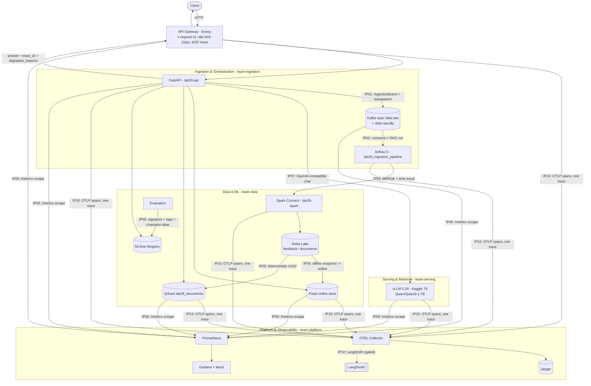

# Phần Trả Lời (Answers) — Lab 28 Track 2

## Giới thiệu

- **Thành viên duy nhất**: Đàm Lê Minh Quân — làm cá nhân, đảm nhiệm cả 5 vai trò
  (Ingestion & Orchestration, Data & ML, Serving & Retrieval, Platform &
  Observability, Presenter).
- **Đóng góp**:
  - Hoàn thiện 4 hàm scaffold trong `src/lab28_platform/integration_tasks.py`:
    `event_headers` (IP01+IP10), `dedupe_latest` (IP03), `feast_online_request`
    (IP04), `readiness_status` (IP07+IP08).
  - Dựng full stack (`docker compose --profile full`) + nối **vLLM thật** (GPU
    Kaggle T4, OpenAI-compatible, qua HTTPS tunnel).
  - Chạy 5 critical journey (J1–J5) + gateway/prometheus/trace suite, thu 12
    evidence file, load profile, failure/recovery và rollback.
  - Hardening tự làm ở phần Platform: scrape target vLLM cho Prometheus
    (`monitoring/prometheus.yml` + `monitoring/targets/`), và tách span
    `lab28.spark.delta_merge` sang service `lab28-spark` để trace phản ánh đúng
    ranh giới process (`spark/delta_merge.py`).
  - `scripts/scrub_evidence.py` để xoá host tunnel khỏi evidence trước khi nộp.

Kết quả tổng: `evidence/integration-report.json` → **`ready: true`, score 100**;
integration suite **70/72 pass** (1 fail `@gpu` đã giải thích ở mục 6, 1
`@langsmith` deselected vì không có credential).

---

## 1. Architecture Diagram (Sơ đồ kiến trúc)



Mọi request đi qua **1 trace ID** duy nhất từ gateway đến vLLM. Ownership ghi trực
tiếp trên subgraph (5 vai trò của `contracts/integration-matrix.yaml`).

---

## 2. Trade-offs (Đánh đổi kỹ thuật)

- **Ingest bằng Airflow + Spark (micro-batch) thay vì streaming (Flink/Kafka
  Streams)**
  - *Lợi*: lịch trình/lỗi/replay quan sát rõ qua DAG run và asset event; scheduler
    vẫn là Python image (không kéo 400 MB Scala); cùng code chạy từ shell và
    Airflow, chỉ khác `LAB28_SPARK_REMOTE`.
  - *Đổi*: có độ trễ giữa lúc user gửi feedback và lúc feature/vector cập nhật
    (một DAG run), không real-time tuyệt đối.
- **Idempotency bằng `MERGE INTO` trên Delta + dedupe theo `(occurred_at,
  event_id)` trước khi merge**
  - *Lợi*: exactly-once ghi bảng bất kể Kafka giao trùng hay DAG chạy lại; time
    travel làm bằng chứng "batch nào đã tới".
  - *Đổi*: `MERGE` tốn I/O + CPU hơn `APPEND`; mỗi lần merge ghi thêm 1 file +
    1 entry `_delta_log`.
- **vLLM chạy remote trên Kaggle qua HTTPS tunnel thay vì container GPU local**
  - *Lợi*: giải quyết giới hạn "máy không có GPU" mà vẫn là vLLM thật (gate IP07
    yêu cầu `/version`, `/v1/models`, metric `vllm:` — server giả OpenAI không
    qua được).
  - *Đổi*: `/ready` fan-out gọi vLLM mỗi lần → tunnel round-trip là nút thắt độ
    trễ (xem mục 7); tunnel free không ổn định, đứt vài lần trong buổi làm.
- **Gateway health check trên `/health` (liveness), readiness được proxy**
  - *Lợi*: client vẫn thấy được báo cáo degraded chi tiết thay vì "no healthy
    upstream" mờ mịt.
  - *Đổi*: Envoy dev 1 replica không tự loại pod `not_ready` (xem mục 6). Bản
    production đúng nằm ở `deploy/kubernetes/base/api.yaml`: `replicas: 2` +
    `readinessProbe: /ready`.

---

## 3. Production Gaps (Khoảng cách so với hệ thống thật)

- **AuthN/AuthZ**: gateway mới có rate limit + `x-request-id`, chưa có JWT/OAuth2
  hay mTLS. Production cần chặn endpoint ghi (`/api/v1/feedback`,
  `/api/v1/documents`) sau xác thực.
- **Auto-scaling**: Compose cố định tài nguyên. `deploy/kubernetes/base/` đã có
  `HorizontalPodAutoscaler` + `PodDisruptionBudget` nhưng chưa chạy trên cluster
  thật; cần HPA theo `lab28_request_seconds` / queue depth của vLLM.
- **Alerting routing**: `monitoring/alerts.yml` có 2 rule (`Lab28ApiUnavailable`
  critical, `Lab28HighErrorRatio` warning) load & evaluate OK, nhưng chưa nối
  Alertmanager → Slack/email/PagerDuty.
- **vLLM HA & cost**: 1 endpoint T4, không autoscale, không tensor-parallel; cold
  start ~3 phút; session/quota Kaggle hết giữa buổi là mất serving. Cần cụm vLLM
  có replica + KV-cache warm.
- **Readiness cost**: `/ready` gọi thật mọi dependency mỗi request, không cache →
  không hợp làm health endpoint cho load balancer QPS cao (xem mục 7).
- **DLQ chưa auto-replay**: poison message vào `data.raw.dlq` đúng, nhưng phải
  người vận hành replay sau khi sửa nguyên nhân.

---

## 4. Happy-path Trace & Versions

Số liệu từ `evidence/` (suite run 4, 2026-09-03):

| Hạng mục | Giá trị |
|---|---|
| Trace ID (span coverage) | `f1cb10a5269340a0bc18d000bcf09525` — 24 span, `required_spans_missing: []` |
| Services trên trace | `lab28-gateway`, `lab28-api`, `lab28-airflow`, `lab28-spark` (4) |
| Airflow DAG run | `it-c1199679` — `state: success`, 4 task, 4 asset event |
| Kafka | topic `data.raw`, có `traceparent` + `idempotency-key` header |
| Delta version | `feedback` v30 (42 rows), `documents` v16 (25 rows); `last_operation: MERGE` + block time_travel |
| Feast online | entity present, `delta_version` 24, `freshness_seconds` ~32 |
| Qdrant | 25 point, model `sentence-transformers/paraphrase-multilingual-MiniLM-L12-v2@faf4aa42…` |
| MLflow | `lab28-rag-release` **v10 là champion**, `run_id` `e4c59e00b6154a6bb56071307ee5ba7d` |
| vLLM (IP07) | `is_real_vllm: true`, `/version` `0.28.0`, model `Qwen/Qwen3-1.7B`, **111** metric `vllm:` |
| `integration-report.json` | `ready: true`, `score: 100` |

11 required span đều xuất hiện trên **cùng một trace ID**: `lab28.gateway.request`
→ `lab28.api.ingest` → `lab28.kafka.produce` → `lab28.kafka.consume` →
`lab28.airflow.dag` → `lab28.spark.delta_merge` → `lab28.api.ask` →
`lab28.feast.get_online_features` → `lab28.qdrant.query` →
`lab28.mlflow.resolve_release` → `lab28.vllm.chat_completion`.

---

## 5. Failure / Recovery Record (No Data Loss Proof)

Chi tiết + timestamp: `evidence/failure-recovery.md`.

- **Live outage (read path)**: `docker compose stop feast` lúc 09:35:31Z →
  `/ready` = `degraded` (chỉ `feast.ready=false`), `lab28 ask` vẫn **HTTP 200**
  kèm câu trả lời 1241 ký tự + `degraded_reasons: ["feature store unavailable:
  … ConnectError"]`. `docker compose start feast` lúc 09:36:01Z → `ready` lại sau
  ~10s. Delta **trước = sau**: `feedback` v30/42 rows, `documents` v16/25 rows →
  không mất dữ liệu.
- **Write path (J4, đều pass)**: poison message → `data.raw.dlq` (DAG run vẫn
  `success`); record hợp lệ cùng batch vẫn vào Delta đúng 1 lần; replay sau "crash"
  MERGE vào cùng row (1 row/`idempotency_key`).
- **Mandatory vs degradable**: mất Qdrant (retrieval, bắt buộc) → readiness fail
  *closed* (503, nêu tên dependency); mất Feast (feature, degradable) → phục vụ
  degraded + tăng `lab28_degraded_responses_total`.

---

## 6. Load Profile (Hiệu suất & Nút thắt)

`uv run python load-tests/run_profile.py --requests 200 --workers 8` →
`load_profile_report.txt`:

| Chỉ số | Giá trị |
|---|---|
| Requests | 200 / 8 workers |
| status_counts | **`{"200": 200}`** — 0 timeout |
| P50 | 1573 ms |
| P95 | 1968 ms |
| P99 | 2454 ms |

**Bottleneck**: probe bắn vào `GET /ready`, mà `/ready` gọi **thật** cả 5
dependency mỗi request, không cache — trong đó `probe_identity(vLLM)` là 3
round-trip HTTP tuần tự sang endpoint Kaggle qua Cloudflare tunnel. Đó là ~1.5–2s
mỗi call. Dưới 8 worker song song, tunnel serialize nên P95 leo lên gần 2s dù
không có request nào fail.

**So với lần đo đầu** (33/100 timeout, P95 5s, P99 9.4s): khác biệt là lần đó vLLM
`require_real=true` nhưng endpoint không kết nối được → mọi `/ready` chờ timeout
10s. Sau khi nối vLLM thật, không còn timeout.

**SLO đề xuất cho production**: load balancer dùng `/health` (liveness, ~1ms), còn
`/ready` cache kết quả probe với TTL ~5s; mục tiêu P95 `/api/v1/ask` < 3s (đo
được `llm_ms` ~6.5s trên T4 đơn — cần vLLM có batch + replica để đạt).

---

## 7. Kubernetes / GitOps Validation

`uv run python scripts/validate_manifests.py` → **passed** (kiểm 9 kind bắt buộc:
Deployment/Service/ServiceAccount/ConfigMap/HPA/PDB/NetworkPolicy/Gateway/HTTPRoute;
image không `:latest`; `runAsNonRoot`; đủ `readinessProbe`+`livenessProbe`+
`resources`+`securityContext`; Gateway API `v1`; Argo `targetRevision` là tag ghim).

*(Lưu ý: "245 checks passed" là output của `scripts/verify_matrix.py` — kiểm
`contracts/integration-matrix.yaml` khớp repo, không phải `validate_manifests.py`.)*

**Drift/rollback** (chi tiết `evidence/gitops-rollback.md`):

- `gitops/application.yaml` ghim Argo CD vào `refs/tags/v3.0.0`, `automated:
  {prune: true, selfHeal: true}` → drift thủ công trên cluster bị kéo về Git ở
  lần sync sau.
- Demo desired-state rollback: sửa tag image `3.0.0 → 3.1.0` trong
  `deploy/kubernetes/base/api.yaml`, validate vẫn pass; `git checkout --` để
  revert; validate pass lại → rollback = thao tác Git.
- Model rollback: `lab28 rollback` chuyển alias `champion` v9 → v8; serving đổi
  ngay ở request kế tiếp, không redeploy (J3 pass).

**Known limitation — 1 test `@gpu` fail**:
`test_j4_degraded_recovery.py::test_the_gateway_stops_routing_to_a_pod_that_is_not_ready`.
Test muốn Envoy trả "no healthy upstream" khi pod `not_ready`. Envoy dev chỉ 1
upstream host và health check cố ý đặt trên `/health` (liveness) để giữ báo cáo
degraded. Đã thử fix bằng `outlier_detection`: J4 pass nhưng làm regress
`test_gateway_rate_limit` (cũng 1 replica — chính comment trong `gateway/envoy.yaml`
cảnh báo mâu thuẫn `healthy_panic_threshold` này), nên **revert**. Pattern đúng đã
có sẵn ở `deploy/kubernetes/base/api.yaml`: `replicas: 2` +
`readinessProbe: /ready` → K8s tự rút pod chưa sẵn sàng khỏi Service endpoints
trong khi replica kia phục vụ. Đây là giới hạn của gateway 1-replica ở chế độ
lab, không phải lỗi luồng dữ liệu.

---

## 8. Lệnh tái lập

```text
# vLLM thật: xem HUONG_DAN_CHI_TIET.md (Kaggle T4 + tunnel), rồi:
docker compose --env-file ports.template --env-file vllm.env --profile full up -d --wait
uv run pytest integration-tests -m "not langsmith" -q      # 70 passed, 1 failed (@gpu, mục 6)
uv run lab28 evidence && uv run lab28 integration          # ready: true
uv run python load-tests/run_profile.py --requests 200 --workers 8
uv run python scripts/scrub_evidence.py                    # xoá host tunnel khỏi evidence
uv run ruff check . && uv run python scripts/verify_matrix.py
uv run python scripts/check_portability.py && uv run python scripts/validate_manifests.py
uv run pytest tests -q                                     # 83 passed
```
